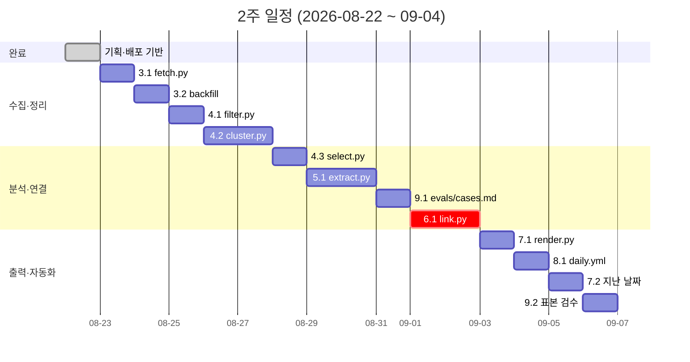

# WBS — 반도체 뉴스 데일리

> 작성 2026-08-22 · 2주 MVP 기준
> 왜·누구는 `PRD.md`, 규칙은 `CLAUDE.md`, 일정 리듬은 `PLAN.md`.

## 읽는 법

- **산출물은 명사로 적는다.** "수집 기능 개발"이 아니라 "일자별 기사 JSON".
  무엇이 나오면 끝인지가 이름에 들어 있어야 한다.
- **완료 조건은 실행 가능한 명령이다.** 형용사로 적으면 판정이 안 된다.
- **잎사귀 하나 = 커밋 하나.** 반나절을 넘으면 더 쪼갠다.
- 시간은 **혼자 작업 기준 예상치**이며 실제와 다를 수 있다.

---

## 1. 전체 구조

```mermaid
graph TD
  R["반도체 뉴스 데일리<br/>2주 MVP"]

  R --> W1["1. 기획<br/>✅ 완료"]
  R --> W2["2. 배포 기반<br/>✅ 완료"]
  R --> W3["3. 수집"]
  R --> W4["4. 정리"]
  R --> W5["5. 분석"]
  R --> W6["6. 연결"]
  R --> W7["7. 출력"]
  R --> W8["8. 자동화"]
  R --> W9["9. 검증"]

  W1 --> W11["1.1 PRD.md"]
  W1 --> W12["1.2 CLAUDE.md"]
  W1 --> W13["1.3 data/sources.md"]

  W2 --> W21["2.1 GitHub 저장소"]
  W2 --> W22["2.2 배포된 URL"]
  W2 --> W23["2.3 UI 후보·선정"]

  W3 --> W31["3.1 fetch.py"]
  W3 --> W32["3.2 과거분 backfill"]

  W4 --> W41["4.1 filter.py"]
  W4 --> W42["4.2 cluster.py"]
  W4 --> W43["4.3 select.py"]

  W5 --> W51["5.1 extract.py"]
  W5 --> W52["5.2 companies 정규화"]

  W6 --> W61["6.1 link.py"]

  W7 --> W71["7.1 render.py"]
  W7 --> W72["7.2 지난 날짜 목록"]

  W8 --> W81["8.1 daily.yml"]

  W9 --> W91["9.1 evals/cases.md"]
  W9 --> W92["9.2 표본 검수"]

  classDef done fill:#e9f6ee,stroke:#0a7d3c,color:#0a7d3c
  class W1,W2,W11,W12,W13,W21,W22,W23 done
```

---

## 2. 작업 명세

`선행` 은 그 작업이 끝나야 시작할 수 있는 작업이다.

### 1. 기획 — ✅ 완료 (약 8h)

| 코드 | 산출물 | 완료 조건 | 선행 | 시간 | 상태 |
| --- | --- | --- | --- | --- | --- |
| 1.1 | `PRD.md` | 한 페이지 · '안 만들 것' 절 존재 | — | 3h | ✅ |
| 1.2 | `CLAUDE.md` | 가리키는 경로가 모두 실재 · 검토 APPROVE | 1.1 | 3h | ✅ |
| 1.3 | `data/sources.md` | 수집처 8곳 응답·건수 실측 기록 | — | 2h | ✅ |

### 2. 배포 기반 — ✅ 완료 (약 3h)

| 코드 | 산출물 | 완료 조건 | 선행 | 시간 | 상태 |
| --- | --- | --- | --- | --- | --- |
| 2.1 | GitHub 저장소 + remote | `git push` 성공 | — | 0.5h | ✅ |
| 2.2 | 배포된 URL | URL 에서 화면이 뜨고 README 첫 줄에 기재 | 2.1 | 1h | ✅ |
| 2.3 | UI 후보 3종 + 선정본 | `/` 와 `/ui/*.html` 이 HTTP 200 | 2.2 | 1.5h | ✅ |

### 3. 수집 (약 5h)

| 코드 | 산출물 | 완료 조건 | 선행 | 시간 | 상태 |
| --- | --- | --- | --- | --- | --- |
| 3.1 | `fetch.py` · `data/articles/<날짜>.json` | `python fetch.py` → 파일 생성·건수 출력. 재실행 시 새 기사 0건 | 1.3 | 3h | ☐ |
| 3.2 | 과거분 backfill | `python fetch.py --backfill` → 각 피드가 주는 과거분이 일자별로 쌓임 | 3.1 | 2h | ☐ |

> 3.2 가 없으면 6.1 이 2~3주간 아무것도 못 한다. **미루면 안 된다.**

### 4. 정리 — 모델 안 씀 (약 8h)

| 코드 | 산출물 | 완료 조건 | 선행 | 시간 | 상태 |
| --- | --- | --- | --- | --- | --- |
| 4.1 | `filter.py` · `data/keywords.md` | `python filter.py <날짜>` → 반도체 무관 기사 제외, 걸러낸 건수 출력 | 3.1 | 2h | ☐ |
| 4.2 | `cluster.py` | `python cluster.py <날짜>` → 같은 사건 기사가 한 묶음. 묶음 수 출력 | 4.1 | 4h | ☐ |
| 4.3 | `select.py` | `python select.py <날짜>` → 카테고리당 최대 3건·총 10건. **자른 건수 출력** | 4.2 | 2h | ☐ |

### 5. 분석 — 모델 씀 (약 7h)

| 코드 | 산출물 | 완료 조건 | 선행 | 시간 | 상태 |
| --- | --- | --- | --- | --- | --- |
| 5.1 | `extract.py` | `python extract.py <기사>` → 카테고리·한국어 요약·관계가 정해진 형식으로 출력. **관계마다 원문 인용구 포함** | 4.3 | 5h | ☐ |
| 5.2 | 기업명 정규화 | 사전에 없는 이름이 `data/companies.md` '미확인' 칸에 쌓임 | 5.1 | 2h | ☐ |

### 6. 연결 (약 8h) — **가장 어렵고 가장 중요**

| 코드 | 산출물 | 완료 조건 | 선행 | 시간 | 상태 |
| --- | --- | --- | --- | --- | --- |
| 6.1 | `link.py` | `python link.py <날짜>` → 오늘 사건이 과거 어느 사건의 후속인지 **점수와 함께** 출력. 임계값 아래는 잇지 않음 | 3.2, 5.1 | 8h | ☐ |

> `PRD.md` 의 성공 판정이 이 작업 하나에 걸려 있다. **일정이 밀리면 여기가 아니라 다른 곳을 잘라야 한다.**

### 7. 출력 (약 6h)

| 코드 | 산출물 | 완료 조건 | 선행 | 시간 | 상태 |
| --- | --- | --- | --- | --- | --- |
| 7.1 | `render.py` · `docs/<날짜>.html` | `python render.py <날짜>` → HTML 생성. 브라우저에서 카드·흐름·상태 배지가 보임 | 6.1 | 4h | ☐ |
| 7.2 | 지난 날짜 목록 | `/` 에서 지난 날짜로 이동 가능 | 7.1 | 2h | ☐ |

### 8. 자동화 (약 3h)

| 코드 | 산출물 | 완료 조건 | 선행 | 시간 | 상태 |
| --- | --- | --- | --- | --- | --- |
| 8.1 | `.github/workflows/daily.yml` | Actions 가 정해진 시각에 돌고 `docs/` 커밋이 쌓임. 실패 시 빨간불 | 7.1 | 3h | ☐ |

### 9. 검증 (약 5h)

| 코드 | 산출물 | 완료 조건 | 선행 | 시간 | 상태 |
| --- | --- | --- | --- | --- | --- |
| 9.1 | `evals/cases.md` | 입력·기대·판정 10줄. **실패해야 정상인 케이스 3개 포함** | 5.1 | 3h | ☐ |
| 9.2 | 표본 검수 | 인용구가 원문에 실제로 있는 비율 100% · 잘못 이은 비율 5% 이하 | 9.1, 6.1 | 2h | ☐ |

---

## 3. 일정

**Day 7 체크포인트 (08-28)** — 화면에 오늘 뉴스 10건이 카테고리별로 보여야 한다.
이때 `6.1` 은 아직 없어도 된다.

---

## 4. 합계와 현실성

| 구간 | 시간 |
| --- | --- |
| 완료 (1·2) | 11h |
| 남은 작업 (3~9) | **42h** |

2주를 평일 10일로 보면 **하루 4시간 이상** 써야 한다.
그보다 적게 쓸 수 있다면 아래 순서로 잘라낸다.

| 자를 순서 | 대상 | 잘라도 되는 이유 |
| --- | --- | --- |
| 1 | 7.2 지난 날짜 목록 (2h) | 날짜를 주소로 직접 칠 수 있다 |
| 2 | 5.2 기업명 정규화 (2h) | 없으면 이름이 갈라질 뿐, 화면은 뜬다 |
| 3 | 4.2 cluster.py (4h) | 중복이 그대로 보이지만 10건은 나온다 |
| 4 | 4.1 filter.py 를 수동 키워드로 축소 (1h 절감) | |

**절대 자르면 안 되는 것** — `3.2 backfill` 과 `6.1 link.py`.
이 둘이 빠지면 `PRD.md` 의 성공 판정이 화면에 뜨지 않는다.

## 5. 범위 밖 (이번 2주에 안 함)

| 항목 | 언제 |
| --- | --- |
| 개념 탭 (`data/glossary.md` · `concepts.html`) | 뉴스 흐름이 매일 도는 것을 확인한 뒤 |
| 기업 관계도 그래프 | 데이터 3개월 후 재판단 |
| 카테고리·기업 필터 동작 | 화면만 있고 동작은 나중 |

화면 초안은 `docs/ui/` 에 있다 — 만들 때 다시 쓴다.
