# WBS — 반도체 뉴스 데일리

> 작성 2026-08-22 · **5시간 × 3세션** 기준 (오늘 포함)
> 왜·누구는 `PRD.md`, 규칙은 `CLAUDE.md`.

## 읽는 법

- **산출물은 명사로 적는다.** "수집 기능 개발"이 아니라 "일자별 기사 JSON".
  무엇이 나오면 끝인지가 이름에 들어 있어야 한다.
- **완료 조건은 실행 가능한 명령이다.** 형용사로 적으면 판정이 안 된다.
- **잎사귀 하나 = 커밋 하나.** 한 세션에 서너 개가 한계다.
- **세션 1은 이미 지났다.** 남은 것은 두 세션뿐이다.

---

## 1. 전체 구조

초록은 완료, 회색은 이번 범위 밖.

```mermaid
graph TD
  R["반도체 뉴스 데일리"]

  R --> W1["1. 기획<br/>세션 1 ✅"]
  R --> W2["2. 배포 기반<br/>세션 1 ✅"]
  R --> W3["3. 수집<br/>세션 2"]
  R --> W4["4. 선별<br/>세션 2"]
  R --> W5["5. 출력<br/>세션 2"]
  R --> W6["6. 분석<br/>세션 3"]
  R --> W7["7. 연결<br/>세션 3"]
  R --> W8["8. 자동화<br/>세션 3"]
  R --> WX["X. 범위 밖"]

  W1 --> W11["1.1 PRD.md"]
  W1 --> W12["1.2 CLAUDE.md"]
  W1 --> W13["1.3 data/sources.md"]

  W2 --> W21["2.1 GitHub 저장소"]
  W2 --> W22["2.2 배포된 URL"]
  W2 --> W23["2.3 UI 후보·선정"]

  W3 --> W31["3.1 fetch.py"]
  W3 --> W32["3.2 backfill"]

  W4 --> W41["4.1 filter.py"]
  W4 --> W42["4.2 pick.py"]

  W5 --> W51["5.1 render.py"]

  W6 --> W61["6.1 extract.py"]

  W7 --> W71["7.1 link.py"]

  W8 --> W81["8.1 daily.yml"]

  WX --> X1["cluster.py 중복 묶기"]
  WX --> X2["기업명 정규화"]
  WX --> X3["개념 탭"]
  WX --> X4["지난 날짜 목록"]
  WX --> X5["필터 칩 동작"]

  classDef done fill:#e9f6ee,stroke:#0a7d3c,color:#0a7d3c
  classDef out fill:#f2f1ee,stroke:#b8b4ac,color:#8b8577
  class W1,W2,W11,W12,W13,W21,W22,W23 done
  class WX,X1,X2,X3,X4,X5 out
```

---

## 2. 작업 명세

`선행` 은 그 작업이 끝나야 시작할 수 있는 작업이다.

### 세션 1 — 기획·배포 ✅ 완료

| 코드 | 산출물 | 완료 조건 | 선행 | 상태 |
| --- | --- | --- | --- | --- |
| 1.1 | `PRD.md` | 한 페이지 · '안 만들 것' 절 존재 | — | ✅ |
| 1.2 | `CLAUDE.md` | 가리키는 경로가 모두 실재 · 검토 APPROVE | 1.1 | ✅ |
| 1.3 | `data/sources.md` | 수집처 8곳 응답·건수 실측 기록 | — | ✅ |
| 2.1 | GitHub 저장소 + remote | `git push` 성공 | — | ✅ |
| 2.2 | 배포된 URL | URL 에서 화면이 뜨고 README 첫 줄에 기재 | 2.1 | ✅ |
| 2.3 | UI 후보 3종 + 선정본 | `/` 와 `/ui/*.html` 이 HTTP 200 | 2.2 | ✅ |

### 세션 2 — 화면에 뉴스가 뜬다

**이 세션의 끝:** 오늘 뉴스 10건이 사이트에 보인다. 모델은 아직 안 쓴다.

| 코드 | 산출물 | 완료 조건 | 선행 | 상태 |
| --- | --- | --- | --- | --- |
| 3.1 | `fetch.py` · `data/articles/<날짜>.json` | `python fetch.py` → 파일 생성·건수 출력. 재실행 시 새 기사 0건 | 1.3 | ☐ |
| 3.2 | 과거분 backfill | `python fetch.py --backfill` → 각 피드가 주는 과거분이 일자별로 쌓임 | 3.1 | ☐ |
| 4.1 | `filter.py` · `data/keywords.md` | `python filter.py <날짜>` → 반도체 무관 기사 제외, 걸러낸 건수 출력 | 3.1 | ☐ |
| 4.2 | `pick.py` | `python pick.py <날짜>` → 카테고리당 최대 3건·총 10건. **자른 건수 출력** | 4.1 | ☐ |
| 5.1 | `render.py` · `docs/<날짜>.html` | `python render.py <날짜>` → HTML 생성. 브라우저에서 카드가 보임 | 4.2 | ☐ |

> 세션 2 는 **모델을 한 번도 부르지 않는다.** 수집과 화면이 도는지 먼저 확인한다.
> 이 시점의 카테고리는 키워드로만 나눈다 — 애매하면 전부 `미분류`.

### 세션 3 — 연결이 보인다

**이 세션의 끝:** 카드 아래에 '이어지는 흐름'이 펼쳐진다. = `PRD.md` 성공 판정.

| 코드 | 산출물 | 완료 조건 | 선행 | 상태 |
| --- | --- | --- | --- | --- |
| 6.1 | `extract.py` | `python extract.py <기사>` → 카테고리·한국어 요약·관계가 정해진 형식으로 출력. **관계마다 원문 인용구 포함** | 5.1 | ☐ |
| 7.1 | `link.py` | `python link.py <날짜>` → 오늘 사건이 과거 어느 사건의 후속인지 **점수와 함께** 출력. 임계값 아래는 잇지 않음 | 3.2, 6.1 | ☐ |
| 8.1 | `.github/workflows/daily.yml` | Actions 가 정해진 시각에 돌고 `docs/` 커밋이 쌓임. 실패 시 빨간불 | 7.1 | ☐ |

---

## 3. 범위 밖 — 이번 3세션에 안 함

버리는 것이 아니라 **순서를 미룬 것**이다.

| 항목 | 없으면 어떻게 되나 | 언제 |
| --- | --- | --- |
| `cluster.py` 중복 묶기 | 같은 사건이 여러 건으로 보인다. 10건은 그대로 나온다 | 다음 |
| 기업명 정규화 | `NVIDIA` 와 `엔비디아` 가 갈라진다. 연결이 조금 덜 잡힌다 | 다음 |
| 개념 탭 | 용어 링크가 없다 | 뉴스가 매일 돈 뒤 |
| 지난 날짜 목록 | 주소를 직접 쳐야 한다 | 다음 |
| 필터 칩 동작 | 화면에 보이지만 눌러도 안 걸린다 | 다음 |
| `evals/cases.md` | 품질을 표로 못 잰다 | 세션 3 에 여유가 생기면 |

---

## 4. 세션 3 이 밀릴 때 자르는 순서

세션 3 은 넣은 것이 이미 최소다. 그래도 시간이 부족하면 이 순서로 줄인다.

| 순서 | 무엇을 | 어떻게 줄이나 |
| --- | --- | --- |
| 1 | `8.1 daily.yml` | 자동 실행을 포기하고 **손으로 돌린다.** 사이트는 그대로 뜬다 |
| 2 | `6.1` 의 관계 추출 | 분류·요약만 하고 **관계는 뺀다.** 연결은 기업명 겹침만으로 판정 |
| 3 | `7.1` 의 점수식 | 공통 기업 수 하나로만 잇는다. 시간 거리·키워드는 뺀다 |

**절대 자르면 안 되는 것 — `3.2 backfill` 과 `7.1 link.py`.**
이 둘이 빠지면 `PRD.md` 의 성공 판정이 화면에 뜨지 않는다.
`3.2` 는 세션 2 에 두었는데, **과거분이 없으면 세션 3 의 연결이 빈 화면이 되기 때문**이다.
